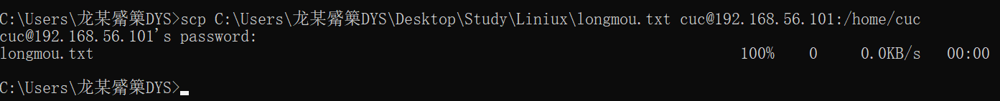
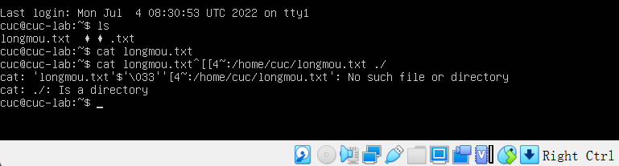
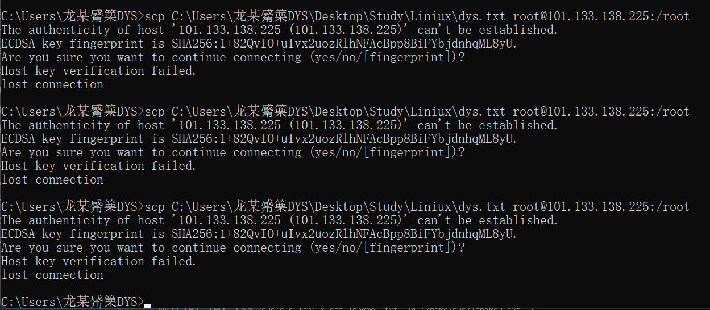

# 第一章：linux基础

## 实验软件环境

Oracle VM VirtualBox

Ubuntu 20.04.02 Server 64bit

## 实验问题

调查并记录实验环境的如下信息

当前linux发行版本基本信息

当前linux内核版本信息

Virtualbox 安装完 Ubuntu 之后新添加的网卡如何实现系统开机自动启用和自动获取 IP？

如何使用`scp` 在「虚拟机和宿主机之间」、「本机和远程 Linux 系统之间」传输文件？

如何配置 SSH 免密登录？

## 一、调查并记录实验环境

### 查询当前Linux发行版基本信息

操作过程

通过LSB（Linux标准库）能够打印发行版的具体信息，包括发行版名称、版本号、代号等

操作代码：

`shell`

`lsb_release -a`

可得到目前发行版本代号为：20.04

### 查询当前 Linux 内核版本信息

操作过程

uname（unix name 的意思） 是一个打印系统信息的工具，包括内核名称、版本号、系统详细信息以及所运行的操作系统等等。

操作代码：

`shell`

`uname -a`

## 二、Virtualbox 安装完 Ubuntu 之后新添加的网卡如何实现系统开机自动启用和自动获取 IP？

### 具体过程

网络配置

在 `NAT` 的基础上再开启另一块网卡 `Host-Only` ，使用 `netplan` 配置。

第一步，查询当前网卡使用情况

`shell`

`ip a`

第二步，修改配置文件并应用

`shell`

`sudo vim /etc/netplan/01-netcfg.yaml`

` sudo netplan apply`

但是好像这步之前就做到过

## 三、如何使用 scp 在「虚拟机和宿主机之间」、「本机和远程 Linux 系统之间」传输文件？

宿主机发到虚拟机

新建`longmou.txt`文件

发送`scp C:\Users\龙某觱篥DYS\Desktop\Study\Liniux\longmou.txt cuc@192.168.56.101:/home/cuc`

虚拟机发送到主机

查看要发送的文件`cat`

修改要发送的文件 `vim`  按 `I`键进行修改，按 `esc`退出，`：wq`退出编辑器

发送文件

`scp cuc@192.168.56.101:/home/cuc/longmou.txt ./`

然后删除源文件

使用scp实现「本机和远程 Linux 系统之间」传输文件：

首先登录阿里云平台，使用Linux指令入门-文件与权限的云服务场景，

弹性IP：101.133.138.225 私有地址：172.16.21.240 用户：root 密码：Yv8Oe6Re5Kg3

连接本机和云平台然后发送

scp C:\Users\龙某觱篥DYS\Desktop\Study\Liniux\dys.txt root@101.133.138.225:/root

一直显示断开连接，已然尽力

## 四、如何配置 SSH 免密登录？

具体过程

gitbash上进行的操作

`shell`

` ssh-keygen -t rsa`

提示输入东西的时候，连续按3次enter 就好，在~/.ssh目录 下生成了 `id_rsa` 和 `id_rsa.pub`两个文件，

复制公钥到虚拟机 `scp C:\Users\龙某觱篥DYS\.ssh\id_rsa.pub cuc@192.168.56.101:~/.ssh`

将公钥 复制为key文件

没有成功，将公钥传输到虚拟机后，在虚拟机中找不到相应文件，已然尽力
